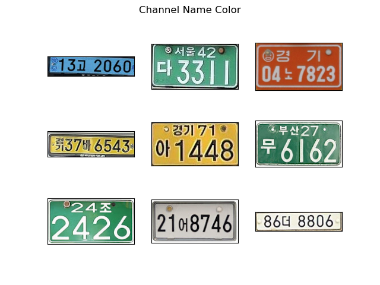
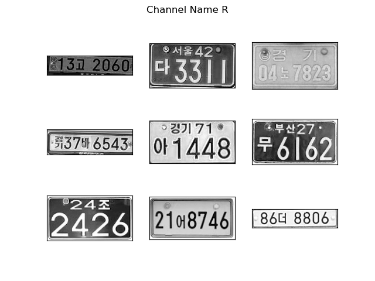
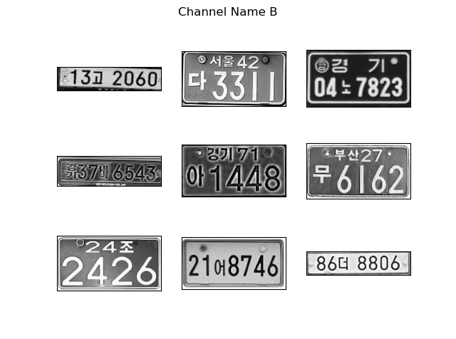

# TCN LPR

## Outline

1. TCN based license plate recognition
2. Replace the shortcut of residual block with xxx in TCN
3. Choose G channel to replace the traditional grayscale channel

改进点：

1. 该网络是基于TCN的车牌识别网络，避免使用了任何RNNs。

|           Original image            |              R channel              |              G channel              |              B channel              |
| :---------------------------------: | :---------------------------------: | :---------------------------------: | :---------------------------------: |
|  |  |  |  |

上方表格左侧为韩国常见的几种车牌类型，通过对其RGB通道单独分离不难看出，在单独G通道下，车牌的显像效果最为显著，受影响较小。
