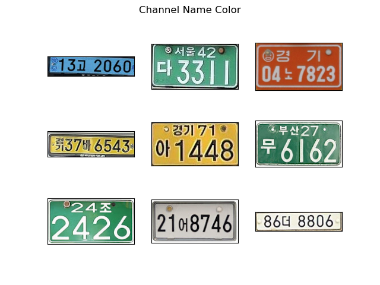
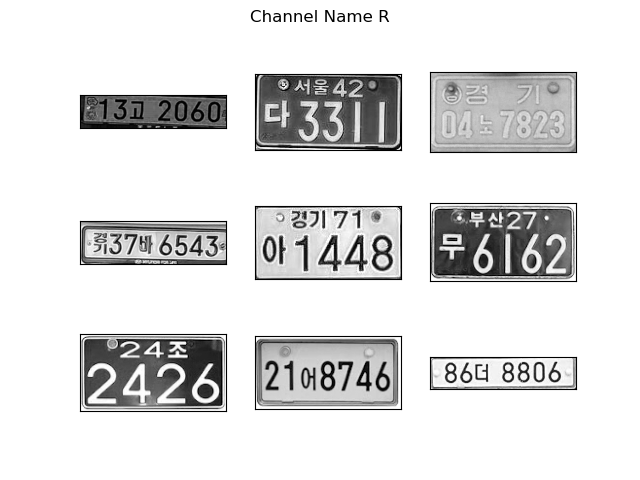
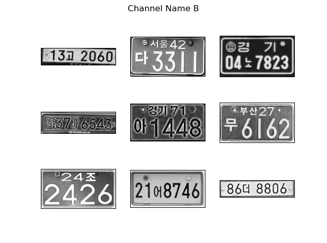

# TCN LPR

## Outline

1. TCN based license plate recognition
2. Replace the shortcut of residual block with xxx in TCN
3. Choose G channel to replace the traditional grayscale channel

改进点：

1. 该网络是基于TCN的车牌识别网络，避免使用了任何RNNs。进而减少了内存消耗。
2. 相较于LPRNet，针对性的增加了对双行车牌的识别。
3. 端对端的车牌识别，减少了传统车牌识别对数字分割的依赖。
4. 实验性的提出了利用 G 通道进行车牌识别。

## Detail

|           Original image            |              R channel              |              G channel              |              B channel              |
| :---------------------------------: | :---------------------------------: | :---------------------------------: | :---------------------------------: |
|  |  |  |  |

上方表格左侧为韩国常见的几种车牌类型，通过对其RGB通道单独分离不难看出，在单独G通道下，车牌的显像效果最为显著，受影响较小。

## FLOPs

|Model|FLOPs (G)|
|:---:|:---:|
|TCNLPR| 0.23|

## Todo

[] 实验绿色通道相较于 grayscale 的增益

[] Speed test of TCN based LPR and LPRNet of intel

[] Comparing MS-TCN++ and basic TCN

[] Quantization of TCN based LPR and its accuracy
